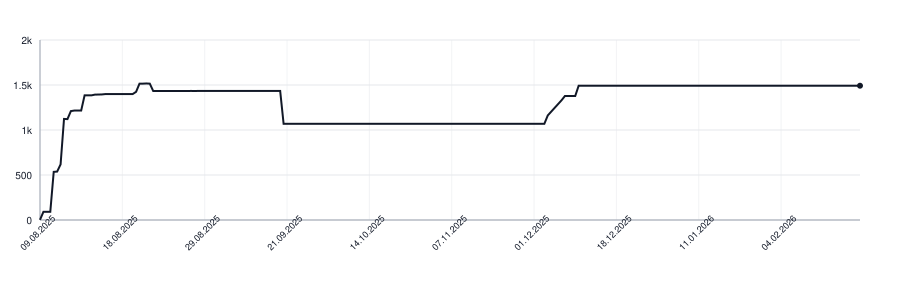

[](https://github.com/apakabarlabs/syllabreak-swift/actions/workflows/tests.yml)
[](https://apakabarlabs.github.io/syllabreak-swift/documentation/syllabreak/)
# syllabreak-swift

Multilingual library for accurate and deterministic hyphenation and syllable counting without relying on dictionaries.

This is a Swift port of [syllabreak-python](https://github.com/apakabarlabs/syllabreak-python). Rules and tests are synced from there via `make sync-yaml`.

## Supported Languages

- 🇬🇧 English (`eng`)
- 🇷🇺 Russian (`rus`)
- 🇷🇸 Serbian Cyrillic (`srp-cyrl`)
- 🇷🇸 Serbian Latin (`srp-latn`)
- 🇧🇦 Bosnian (`bos`)
- 🇭🇷 Croatian (`hrv`)
- 🇲🇪 Montenegrin Latin (`cnr-latn`)
- 🇲🇪 Montenegrin Cyrillic (`cnr-cyrl`)
- 🇹🇷 Turkish (`tur`)
- 🇰🇿 Kazakh (`kaz`)
- 🇰🇬 Kyrgyz (`kir`)
- 🇬🇷 Modern Greek (`ell`)
- 🏛️ Ancient Greek (`grc`)
- 🇬🇪 Georgian (`kat`)
- 🇭🇺 Hungarian (`hun`)
- 🇩🇪 German (`deu`)
- 🇫🇷 French (`fra`)
- 🇷🇴 Romanian (`ron`)
- 🇪🇸 Spanish (`spa`)
- 🇵🇹 Portuguese (`por`)
- 🇵🇱 Polish (`pol`)
- 🇱🇻 Latvian (`lav`)
- 🇦🇲 Armenian (`hye`)
- 🇫🇮 Finnish (`fin`)
- 🇳🇱 Dutch (`nld`)
- 🇸🇪 Swedish (`swe`)
- 🇰🇪 Swahili (`swh`)
- 🇻🇳 Vietnamese (`vie`)
- 🏛️ Latin (`lat`)

## Why syllabification isn't trivial

A few language-specific quirks the algorithm has to encode. Each one would otherwise produce visibly wrong splits.

- **BCMS (bos, hrv, cnr)** — long-jat reflex `ije` is **one** syllable: `mli-je-ko` is wrong, `mlije-ko` is correct. Two graphic-but-not-jat exceptions are `dvije` and `prije` (Matešić 2015, rule P11). `srp-latn` does not encode `ije` because Serbian dictionaries cover both ekavian and ijekavian; pass `lang: "hrv"` (or `bos`/`cnr-latn`) for ijekavian text.
- **Montenegrin** adds `ś`/`ź` (Latin) and `с́`/`з́` (Cyrillic, decomposed `с` + U+0301 only — no precomposed Unicode points exist).
- **French** — `eau` is a trigraph vowel: `châ-teau`.
- **Romanian** — final `-i` after a consonant is palatalization, not a separate syllable.
- **German** — `st` between vowels splits after a short nucleus but stays together after a long one.
- **Latin** — hiatus is mandatory.
- **Polish** — digraphs `sz`, `cz`, `rz`, `dz`, `ch` stay together.
- **Hungarian** — only one consonant moves to the next syllable, so even valid onset clusters split (`ab-lak`, not `a-blak`). Geminate digraphs (`ssz`, `ggy`, `nny`, `lly`, `tty`, `ccs`, `zzs`, `ddz`, `ddzs`) are written compactly and restored in full at the break per AkH 12 §226 (`asz-szony`, `meny-nyi`).
- **Turkic Cyrillic (kaz, kir)** — strict VC-CV: only one consonant moves to the next syllable, three-consonant clusters split 2|1. Kyrgyz long vowels (`аа`, `ээ`, `оо`, `ии`, `уу`, `өө`, `үү`) form a single nucleus (`буу-дай`).
- **Latvian** — V-CV/VC-CV with muta-cum-liquida kept (`la-brīt`). Diphthongs `ai`, `au`, `ei`, `ie`, `iu`, `oi`, `ui`, `eu`, `ou` form a single nucleus. Macron vowels are shared with Latin, so detection without a cedilla letter (`ļ`, `ķ`, `ģ`, `ņ`) keeps `lat` first.
- **Armenian** — strict V-CV/VC-CV (Oxford: "Word-internally, -CC- is perceived as a natural syllable boundary"). Three-consonant clusters split CC|C by the same default long-cluster rule used for Turkic/Hungarian-style strict VC-CV languages. No `clusters_keep_next`; native phonotactics disallow CCV- onsets. `ու` is a single vowel digraph; `և` (yev) counts as one vowel-bearing letter. Pronounced schwa between written consonants (`դպրոց` → [də.pə.rɔts]) is not orthographic.
- **Finnish** — strict V-CV/VC-CV per VISK §11–14 and Karlsson (1999). Long vowels and i/u/y-ending diphthongs are single nuclei in any position; opening diphthongs (`ie uo yö`) are formally root-initial only but treated as one nucleus everywhere. Any 3+ vowel sequence splits as hiatus. Auto-detect caveat: the Finnish alphabet is a subset of German's — pass `lang="fin"` explicitly.
- **Dutch** — strict V-CV for one consonant, VC-CV for two consonants (`kas-teel`, `mees-ter`, `pis-tool`). Muta-cum-liquida (`br bl dr fr fl gr gl kr kl pr pl tr vr wr`) stays together (`pa-troon`, `a-tri-um`). In 3+ consonant clusters, s-onsets and `tj`/`sch` also keep with the next syllable (`ven-ster`, `ham-ster`, `in-dus-trie`, `pad-den-stoel`) — encoded via a new `trailing_onsets` field that only applies in this position. `ch` is a single phoneme; vowel digraphs and triphthongs (`aai ooi oei eeu ieu`) are single nuclei. Hiatus marked by diaeresis (`idee-ën`, `pa-ti-ënt`). Auto-detect caveat: no unique characters relative to German — pass `lang="nld"` explicitly.
- **Swedish** — `enkonsonantsprincipen` per SAOL: one consonant moves to the next syllable, strict V-CV / VC-CV (`sko-la`, `kvin-na`, `vac-ker`, `män-nis-ka`, `Hel-sing-fors`). No native vowel digraphs. Phonetically conditioned exceptions (`/ŋ/`-`ng`, `/ɧ/`-`sk/sj/...`) and morphology-based `ordledsprincipen` for compounds (`glas-ögon`) are not encoded. Auto-detect: `å` routes cleanly to Swedish; `ä`/`ö`-only words collide with German/Dutch/Finnish — pass `lang="swe"` explicitly.
- **Swahili (Kiswahili)** — Bantu CV syllables. Prenasalized consonant digraphs `mb nd nj ng mv nz` and the palatal nasal `ny` count as single onsets (`mbu-zi`, `ja-mbo`, `nji-a`, `nyu-mba`). Word-initial `m`/`n` before a non-prenasalising consonant forms its own syllable (`m-to-to`, `n-chi`, `m-pi-shi`). Glide clusters `mw/my` and other `Cw/Cy` (sw, kw, bw, pw, ...) stay with the following vowel (`mwa-na`, `Ki-swa-hi-li`, `bwa-na`). Auto-detect: plain ASCII — pass `lang="swh"` explicitly.
- **Vietnamese** — Latin alphabet with rich diacritics (12 base vowels × 6 tone variants = 72 precomposed forms, enumerated for autodetect). Consonant digraphs `ch gh gi kh ng ngh nh ph qu th tr` recognised. Vowel di- and triphthongs listed in **base-stripped** form (`uoi`, `ieu`, `yeu`, ...) so the tokenizer's Mn-skip path matches across diacritic runs — `người`, `nhiều`, `tuổi`, `yêu` all syllabify as one nucleus. The letter `đ` listed explicitly.
- **Modern Greek** — V-CV; consonant clusters keep together with the following nucleus only if they form a valid Greek word-initial onset, up to length 3 (`βι-βλί-ο` with βλ, `ά-στρο` with στρ, `άν-θρω-πος` with θρ, `συ-γκρί-νω` with γκρ via the μπ/ντ/γκ digraph rule). Identical doubled consonants always split (`ελ-λη-νι-κά`, `θά-λασ-σα`, `γράμ-μα`). Vowel digraphs αι/ει/οι/υι/αυ/ευ/ηυ/ου (with all accent positions, e.g. `άι` in `τσάι`) are a single nucleus; consonant digraphs μπ/ντ/γκ/γγ/τζ/τσ are a single consonant (school orthographic convention — phonetically μπ/ντ/γκ are sometimes two consonants mid-word, but the spelling rule treats them as one). Adjacent vowels not forming a digraph split as hiatus (`λα-ός`, `α-έ-ρας`, `βι-βλί-ο`). **Synizesis** (modern phonetic merging of η/ι/υ with a following vowel after a consonant, e.g. `ά-γνοια` as 2 syllables) is **not** applied — the algorithm follows the orthographic 3-syllable split `ά-γνοι-α`.
- **Ancient Greek** — same V-CV / onset principles as Modern Greek. Polytonic accents (smooth/rough breathing, acute/grave/circumflex, iota subscript) ride along their base letter automatically: the engine NFD-normalises input on entry, attaches every Unicode combining mark (Mn category) to the preceding token, and renormalises back to NFC on the way out. Differs from `ell` in two ways: μπ/ντ/γκ/γγ/τζ/τσ are NOT consonant digraphs (they were two phonemes in Classical Greek), and the vowel/consonant list enumerates the full Greek Extended block so polytonic-marked words detect as `grc` rather than `ell`. Plain Greek without polytonic markings is ambiguous; the detector returns `ell` first as the more common modern surface.
- **BCMS** — syllabic `r` between consonants is a syllable nucleus: `prst` and `krv` are one syllable.
- **Georgian** — no digraphs; consonant sequences split unless on a small whitelist of valid onsets.

For BCMS specifically, character-based auto-detect cannot tell `bos`/`hrv`/`srp-latn`/`cnr-latn` apart for text without script-unique letters — the detector returns `srp-latn` first to preserve prior behaviour. Pass `lang:` explicitly to get ijekavian handling.

## Unicode normalization

The engine accepts text in either NFC or NFD form and round-trips back to canonical NFC:

- `syllabify(_:lang:)` normalises input to **NFD** internally, so combining marks (Unicode category `Mn` — accents, breathings, ogonek, iota subscript, cedilla, etc.) sit as their own codepoints. The tokenizer attaches each Mn codepoint to the preceding token automatically; while matching digraphs it can also skip over marks placed between two base letters (Greek `ἀι` = α + U+0313 + ι still matches the `αι` entry, Vietnamese `yêu` = y + e + ◌̂ + u matches the `yeu` triphthong base entry). A diaeresis (U+0308) on the closing base of a candidate digraph vetoes the match — that's the standard convention for `αϊ`, `Μαΐου`, `naïf` and similar hiatus markers. The returned string is renormalised to **NFC** before being handed back. The Swift tokenizer iterates Unicode scalars (not grapheme clusters) so polytonic Greek and Vietnamese tones round-trip correctly.
- `detectLanguage(_:)` normalises input to NFC and scores it against each rule's character set. Precomposed letters discriminate well (Polish `ą`, German `ä`, polytonic Greek `ἤ`, Vietnamese `ư`/`ơ`/`đ`) via each rule's `uniqueChars`.
- In rule files, character sets (`vowels`, `consonants`, …) hold the base letters as they appear in `rules.yaml`. Multi-character entries (`digraphVowels`, `dontSplitDigraphs`, `clustersKeepNext`, `trailingOnsets`, …) are stored as the union of their NFC form and their NFD decomposition, so entries with precomposed letters (deu `üh`) still match against the NFD-tokenised input. Combining marks themselves never need listing — the Mn auto-attach takes care of them. For triphthongs that survive NFD as a longer run of codepoints (Vietnamese `ươi`), the Mn-skip path matches the base-stripped form (`uoi`) listed in the rule, so the engine doesn't need to enumerate every diacritic combination.

## Installation

Swift Package Manager:

```swift
dependencies: [
    .package(url: "https://github.com/apakabarlabs/syllabreak-swift", from: "0.20.0")
]
```

## Usage

### Auto-detect language

When no language is specified, the library automatically detects the most likely language:

```swift
import Syllabreak

let s = Syllabreak(softHyphen: "-")
print(s.syllabify("hello"))        // "hel-lo"
print(s.syllabify("здраво"))       // "здра-во" (Serbian Cyrillic)
print(s.syllabify("привет"))       // "при-вет" (Russian)
```

### Specify language explicitly

You can specify the language code for more predictable results:

```swift
let s = Syllabreak(softHyphen: "-")
print(s.syllabify("problem", lang: "eng"))      // "pro-blem"
print(s.syllabify("problem", lang: "srp-latn")) // "prob-lem"
print(s.syllabify("mlijeko", lang: "hrv"))      // "mlije-ko" (Croatian ije is one syllable)
```

This is useful when:
- The text could match multiple languages
- You want consistent rules for a specific language
- Processing text in a known language

### Listing supported languages

```swift
let s = Syllabreak()
print(s.supportedLanguages())  // ["eng", "rus", "srp-cyrl", ...]
```

### Language detection

The library returns all matching languages sorted by confidence:

```swift
let s = Syllabreak()
print(s.detectLanguage("hello"))   // ["eng", "srp-latn", "tur"]
print(s.detectLanguage("čovek"))   // ["srp-latn", "eng", "tur"]
```

## Out of Scope

Some writing systems do not fit syllabreak's alphabetic-rules paradigm and will not be added — they need fundamentally different algorithms:

- **Chinese, Japanese, Korean** — logographic / mora-syllabic / Hangul-block-based; no vowel/consonant rule engine applies.
- **Arabic** — abjad; short vowels are optional diacritics, so syllabification is undecidable without vocalization.
- **Bengali, Hindi, Sanskrit** — Brahmic abugidas; the unit is the akṣara, which requires Unicode grapheme-cluster logic rather than a flat character table.

## Documentation

The [Swift-DocC API reference](https://apakabarlabs.github.io/syllabreak-swift/documentation/syllabreak/)
is generated from the public API on every push to `main`.

## Development

Run `make install-tools` once after cloning, then use `make build` for the complete local check.

## Lines of Code

<picture>
  <source media="(prefers-color-scheme: dark)" srcset=".github/loc-history-dark.svg">
  <source media="(prefers-color-scheme: light)" srcset=".github/loc-history-light.svg">
  
</picture>
